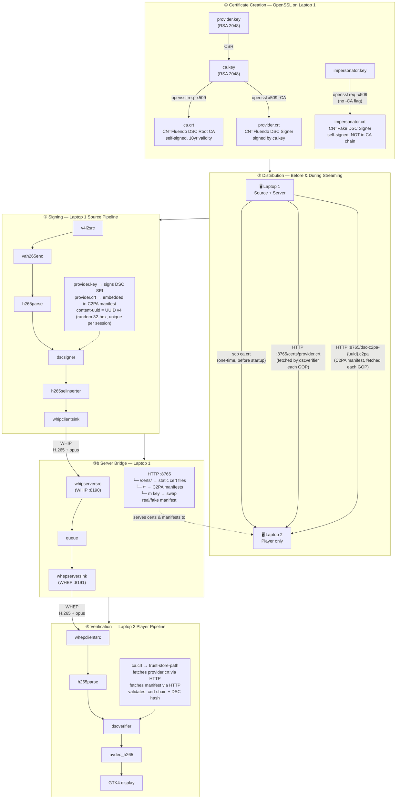
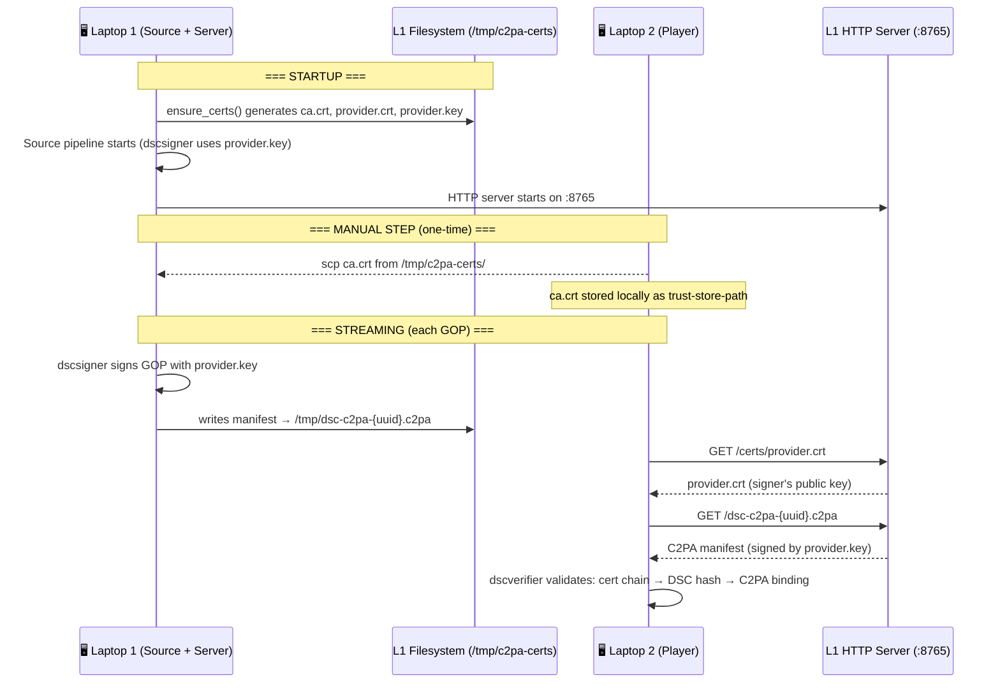
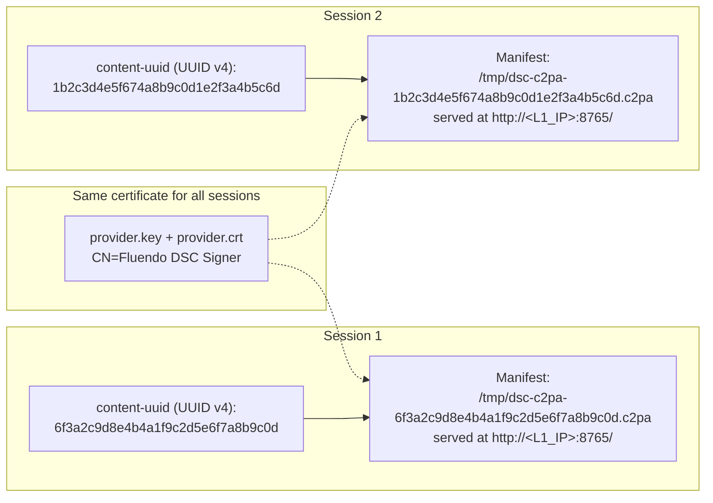
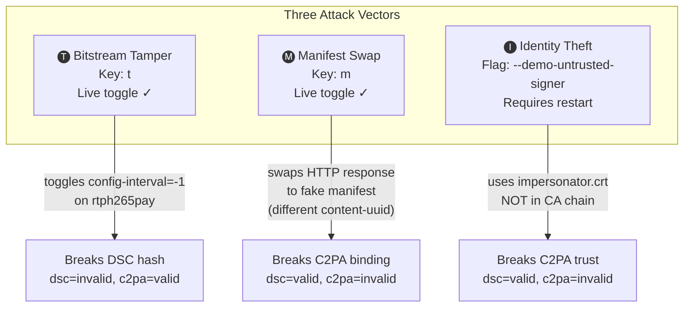

# C2PA-DSC Live Demo

A Rust + GStreamer application demonstrating **Digitally Signed Content (DSC) with C2PA provenance** over WebRTC using WHIP/WHEP protocols. Live H.265 video is signed at the source, streamed through a server bridge, and verified at the player — all with real-time tamper detection.

Three components can run on a single machine or distributed across multiple laptops:

| Component | Role |
|-----------|------|
| **Source** | Camera/v4l2 capture → H.265 encode → DSC/C2PA sign → WHIP ingest |
| **Server** | WHIP↔WHEP bridge + manifest HTTP server (ports 8190, 8191, 8765) |
| **Player** | WHEP playback → DSC/C2PA verify → H.265 decode → GTK4 display |

## Quick Start

```bash
# Single machine — all three components
cargo run
```

```bash
# Laptop 1: Server + Source
cargo run -- --certs-dir /tmp/c2pa-certs \
  --whip-server http://0.0.0.0:8190 \
  --whep-server http://0.0.0.0:8191 \
  --manifest-host <LAPTOP1_IP>:8765

# Laptop 2: Player only
scp user@<LAPTOP1_IP>:/tmp/c2pa-certs/ca.crt /tmp/c2pa-certs/
cargo run -- --player-only \
  --certs-dir /tmp/c2pa-certs \
  --whep-server http://<LAPTOP1_IP>:8191
```

## Build

### Prerequisites

- Rust toolchain
- GStreamer ≥ 1.24 with custom WHIP/WHEP and DSC plugins
- GTK4 development libraries

### Environment

Point these at your GStreamer build and the `gst-plugins-rs` release plugins:

```bash
export LD_LIBRARY_PATH=<gstreamer-prefix>/lib/x86_64-linux-gnu:<gstreamer-prefix>/lib
export GST_PLUGIN_PATH=<gst-plugins-rs>/target/release:<gstreamer-prefix>/lib/x86_64-linux-gnu/gstreamer-1.0
export PKG_CONFIG_PATH=<gstreamer-prefix>/lib/x86_64-linux-gnu/pkgconfig
```

### Compile

```bash
cargo build
```

## Run

### All components (single machine)

```bash
cargo run
```

### Individual components

```bash
cargo run -- --server-only     # WHIP/WHEP bridge + manifest server
cargo run -- --source-only     # Camera ingest + DSC signing
cargo run -- --player-only     # Playback + DSC verification
```

### Demo attacks (live toggles)

Press keys in the terminal running the server:

| Key | Attack | Effect |
|-----|--------|--------|
| `t` | Bitstream tamper | Modifies H.265 bitstream at the server — DSC signature fails |
| `m` | Manifest swap | Replaces provenance manifest with a forged one — C2PA hash binding fails |
| `q` | Quit | Stop the demo |

Use `--demo-untrusted-signer` for an identity theft demo (self-signed cert not in the CA chain):

```bash
cargo run -- --demo-untrusted-signer
```

Use `--demo-ai-filter` to sign the stream as AI-filtered content (the player shows
"AI-filtered" instead of "Webcam (direct)"). This changes the `c2pa.actions`
assertion to `c2pa.created` (`digitalCapture`) + `c2pa.edited`
(`trainedAlgorithmicMedia`) — the camera is still the origin; the AI processing is
a recorded edit on top of it.

```bash
cargo run -- --demo-ai-filter
```

### CLI options

| Flag | Default | Description |
|------|---------|-------------|
| `--whip-server` | `http://127.0.0.1:8190` | WHIP server address |
| `--whep-server` | `http://127.0.0.1:8191` | WHEP server address |
| `--manifest-host` | `127.0.0.1:8765` | Manifest HTTP server host:port |
| `--certs-dir` | `/tmp/c2pa-certs` | Certificate directory |
| `--openssl-config` | `config/c2pa_dsc_unified.cnf` | OpenSSL config for C2PA cert generation |
| `--camera-device` | `/dev/video0` | v4l2 camera device |
| `--demo-untrusted-signer` | `false` | Use impersonator cert for demo |
| `--demo-ai-filter` | `false` | Sign the stream as AI-filtered (`c2pa.edited` = `trainedAlgorithmicMedia`) |
| `--demo-manifest-title` | `FakeStream` | Title for fake manifest |
| `--substream-length` | `3` | DSC GOP size |
| `--hash-method` | `sha256` | DSC hash algorithm |
| `--content-uuid` | auto (UUID v4) | Content UUID override |
| `--server-only` | — | Run only the server bridge |
| `--source-only` | — | Run only the WHIP source |
| `--player-only` | — | Run only the WHEP player |

## Docker

```bash
# Build the base image first (GStreamer + DSC/WebRTC/GTK4 plugins)
docker build -f Dockerfile.base -t c2pa-dsc-base .

# Build the demo image (FROM c2pa-dsc-base:latest)
docker build -t c2pa-dsc-live-demo .
# Allow local Docker containers to access the X server for GUI support
xhost +local:docker

# Run all components
docker run --rm -it \
  --privileged --ipc host --network host --device /dev/dri --device /dev/video0 \
  -e DISPLAY=$DISPLAY \
  -v /tmp/.X11-unix:/tmp/.X11-unix:rw \
  -v /tmp:/tmp:rw \
  -v /run/user/$(id -u)/bus:/run/user/$(id -u)/bus \
  -e DBUS_SESSION_BUS_ADDRESS=unix:path=/run/user/$(id -u)/bus \
  -e GTK_A11Y=none -e NO_AT_BRIDGE=1 \
  c2pa-dsc-live-demo

# Run individually (--network host required)
# Terminal 1 — Server
docker run --rm -it \
  --privileged --ipc host --network host --device /dev/dri \
  -e DISPLAY=$DISPLAY \
  -v /tmp/.X11-unix:/tmp/.X11-unix:rw \
  -v /tmp:/tmp:rw \
  -v /run/user/$(id -u)/bus:/run/user/$(id -u)/bus \
  -e DBUS_SESSION_BUS_ADDRESS=unix:path=/run/user/$(id -u)/bus \
  -e GTK_A11Y=none -e NO_AT_BRIDGE=1 \
  c2pa-dsc-live-demo --server-only \
  --whip-server http://0.0.0.0:8190 --whep-server http://0.0.0.0:8191

# Terminal 2 — Source (wait for server to show "listening")
docker run --rm -it \
  --privileged --ipc host --network host --device /dev/dri --device /dev/video0 \
  -e DISPLAY=$DISPLAY \
  -v /tmp/.X11-unix:/tmp/.X11-unix:rw \
  -v /tmp:/tmp:rw \
  -v /run/user/$(id -u)/bus:/run/user/$(id -u)/bus \
  -e DBUS_SESSION_BUS_ADDRESS=unix:path=/run/user/$(id -u)/bus \
  -e GTK_A11Y=none -e NO_AT_BRIDGE=1 \
  c2pa-dsc-live-demo --source-only

# Terminal 3 — Player
docker run --rm -it \
  --privileged --ipc host --network host --device /dev/dri \
  -e DISPLAY=$DISPLAY \
  -v /tmp/.X11-unix:/tmp/.X11-unix:rw \
  -v /tmp:/tmp:rw \
  -v /run/user/$(id -u)/bus:/run/user/$(id -u)/bus \
  -e DBUS_SESSION_BUS_ADDRESS=unix:path=/run/user/$(id -u)/bus \
  -e GTK_A11Y=none -e NO_AT_BRIDGE=1 \
  c2pa-dsc-live-demo --player-only
```

## Certificate Architecture

This demo uses a **2-tier PKI** and a C2PA manifest chain to prove both content integrity (DSC) and signer identity (C2PA). Two laptops communicate over HTTP to distribute certificates and manifests. Below is a step-by-step walkthrough of the full lifecycle.

> **Diagrams:**
> - [assets/architecture-overview.svg](assets/architecture-overview.svg) — big-picture, client-facing: two laptops, main components only (no element/key names).
> - [assets/cert-workflow.svg](assets/cert-workflow.svg) — detailed version with the GStreamer pipeline and certificate lifecycle.

### Overview Diagram



### Step-by-Step Certificate Lifecycle

#### ① Creation (`cert.rs` — `ensure_certs`)

On **Laptop 1**, when the application starts for the first time, it auto-generates the PKI using OpenSSL with a C2PA-compatible config file:

| File | Role | Command |
|------|------|---------|
| `ca.key` | Root CA private key | `openssl req -x509 -newkey rsa:2048` |
| `ca.crt` | Root CA certificate (self-signed) | same command, `-extensions v3_ca` |
| `provider.key` | Signer private key | `openssl req -new -newkey rsa:2048` |
| `provider.crt` | Signer certificate (CA-signed) | `openssl x509 -req -CA ca.crt -CAkey ca.key` |

The trust chain is: `ca.crt` → `provider.crt`. The player's `dscverifier` uses `ca.crt` as its **trust-store-path**, so any certificate chaining to it is trusted.

For the identity-theft demo (`--demo-untrusted-signer`), a second keypair is generated:
| File | Role | Command |
|------|------|---------|
| `impersonator.key` | Attacker private key | `openssl req -x509 -newkey rsa:2048` |
| `impersonator.crt` | Self-signed, **NOT** in CA chain | same command, different `-subj` |

This cert produces valid DSC signatures (the math checks out) but **fails C2PA trust validation** because it does not chain to `ca.crt`.

#### ② Distribution

Certificates travel from Laptop 1 to Laptop 2 at two different moments:



Key points:
- **`ca.crt`** is transferred **once** before startup via `scp`. This is the root of trust.
- **`provider.crt`** is fetched **on demand** via HTTP from the manifest server (`:8765/certs/`). The `public-key-uri` property on `dscsigner` points to this URL.
- **`provider.key` never leaves Laptop 1**. Only the source component reads it for signing.
- The **C2PA manifest** (`dsc-c2pa-{uuid}.c2pa`) is fetched each GOP via HTTP. The player sets `cache-c2pa-manifest=false` so it re-fetches on every verification cycle.

#### ③ Manifest Creation

Each streaming session produces a unique **content-uuid** — a random UUID v4 (32 hex chars, no hyphens) generated at startup. It can be overridden with `--content-uuid <UUID_HEX>`:

```
content_uuid = uuid::Uuid::new_v4().simple().to_string()
```

The `dscsigner` element uses this UUID in two places:
1. **DSC SEI metadata** — embedded directly in the H.265 bitstream as a SEI NAL unit
2. **C2PA manifest** — a JUMBF-format file written to `/tmp/dsc-c2pa-{uuid}.c2pa` and served over HTTP



Each manifest contains:
- `c2pa.hash.data` — a cryptographic binding to the DSC-protected H.265 content
- The signer's certificate chain (`provider.crt` → `ca.crt`)
- Provenance assertions (creator, actions, ingredients)
- The unique `content-uuid`

The same `provider.key` signs every manifest, but the **hash binding** is different each time because the content-uuid changes per session. The **manifest swap attack** (toggled with `m` key) exploits this: the server serves a pre-generated fake manifest with a **different content-uuid**, causing `c2pa.hash.data` to mismatch the actual bitstream.

#### ④ Verification

On Laptop 2, `dscverifier` performs a 3-layer validation for each GOP:

| Layer | What it checks | Pass condition |
|-------|---------------|----------------|
| **DSC signature** | RSA signature over frame hashes in SEI | Signature is mathematically valid |
| **C2PA cert chain** | `provider.crt` chains to `ca.crt` in trust store | Certificate is trusted by the CA |
| **C2PA hash binding** | `c2pa.hash.data` in manifest matches DSC-protected content | Content-uuid and hash match the bitstream |

The result is posted as a `dsc-c2pa-verification-result` bus message and displayed in the GTK4 UI:

| DSC | C2PA | UI | Meaning |
|-----|------|----|---------|
| ✅ valid | ✅ valid | 🟢 Green checkmark | Full trust: content intact + identity verified |
| ✅ valid | ❌ invalid | 🟡 Yellow warning | Untrusted signer (impersonator demo) |
| ❌ invalid | ✅ valid | 🔴 Red X | Bitstream tampered (payloader attack) |
| ❌ invalid | ❌ invalid | 🔴 Red X | Both tampered and identity compromised |

### Attack Demo Architecture



The attestation server (`:8765`) serves dual roles:
- `/certs/` — static file server for certificates (always serves real certs)
- `/*` — manifest endpoint; toggles between real (`/tmp/dsc-c2pa-{real-uuid}.c2pa`) and fake manifests via the `m` key

## License

This project is licensed under the [Mozilla Public License 2.0](LICENSE).

