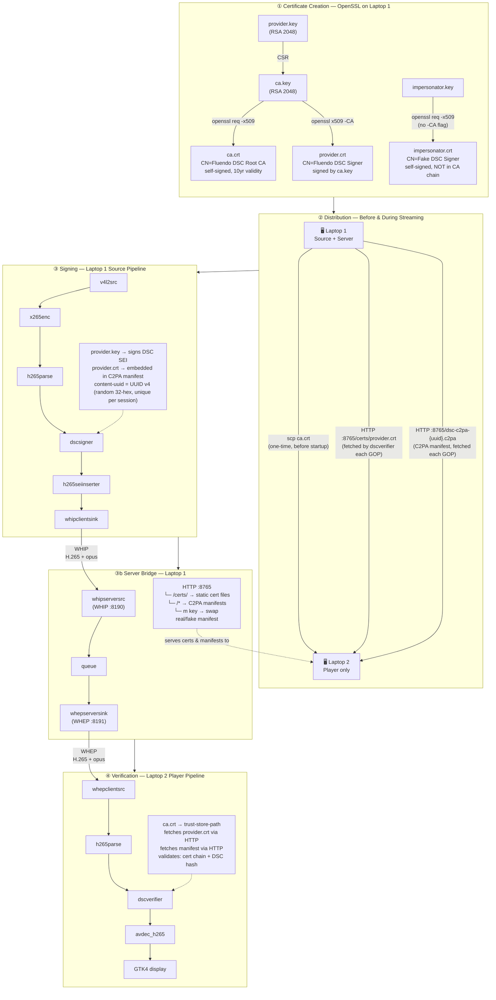
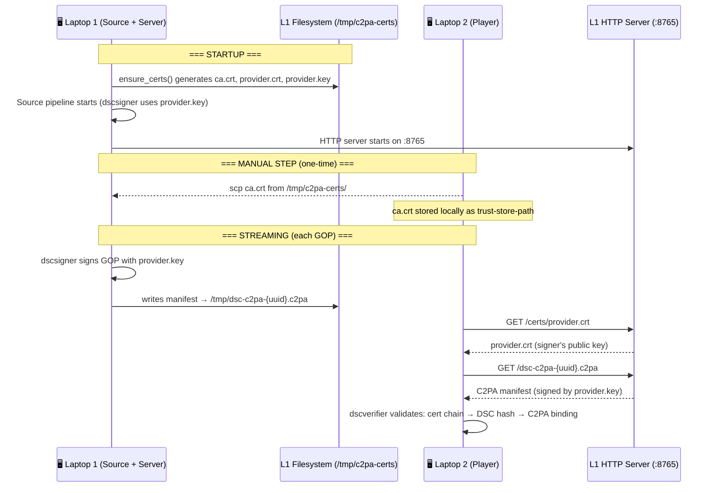
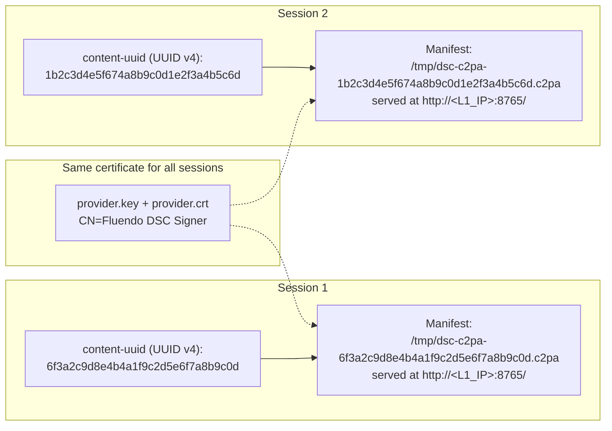
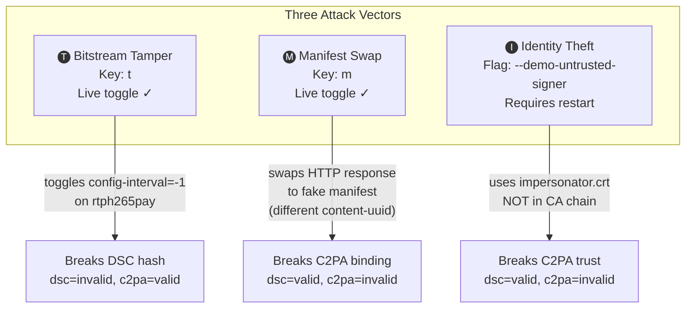

# C2PA-DSC Live Demo

A Rust + GStreamer application demonstrating **Digitally Signed Content (DSC) with C2PA provenance** over WebRTC using WHIP/WHEP protocols. Live H.265 video is signed at the source, streamed through a server bridge, and verified at the player — all with real-time tamper detection.

Three components can run on a single machine or distributed across multiple laptops:

| Component | Role |
|-----------|------|
| **Source** | Camera/v4l2 capture → H.265 encode → DSC/C2PA sign → WHIP ingest |
| **Server** | WHIP↔WHEP bridge + manifest HTTP server (ports 8190, 8191, 8765) |
| **Player** | WHEP playback → DSC/C2PA verify → H.265 decode → GTK4 display |

## Quick Start (Docker Compose)

The fastest way to run the demo is with `docker compose`. Build the images once,
then launch. GUI windows need the X server reachable — run `xhost +local:docker`
once.

```bash
# Build the base image (GStreamer + DSC/WebRTC/GTK4 plugins) and the demo image
docker build -f Dockerfile.base -t c2pa-dsc-base .
docker compose build
```

### Single machine (all-in-one)

Source + Server + Player on one machine:

```bash
docker compose up
```

On **NVIDIA** machines, pass the GPU through so the AI anonymizer uses CUDA
(requires `nvidia-container-toolkit` on the host, and Docker Compose v2):

```bash
docker compose -f docker-compose.yml -f docker-compose.nvidia.yml up
```

### Two laptops

```bash
# Laptop 1 — Source + Server (+ Player); bind to its LAN IP:
SERVER_IP=<LAPTOP1_IP> docker compose up

# Laptop 2 — Player only. Copy Laptop 1's CA cert (the trust anchor) once:
scp user@<LAPTOP1_IP>:/tmp/c2pa-certs/ca.crt /tmp/c2pa-certs/
SERVER_IP=<LAPTOP1_IP> docker compose up player
```

See [Docker](#docker) below for the full explanation, `docker run` equivalents,
and troubleshooting.

## Quick Start (native)

```bash
# Single machine — all three components
cargo run
```

```bash
# Laptop 1: Server + Source
cargo run -- --certs-dir /tmp/c2pa-certs \
  --whip-server http://0.0.0.0:8190 \
  --whep-server http://0.0.0.0:8191 \
  --manifest-host <LAPTOP1_IP>:8765

# Laptop 2: Player only
scp user@<LAPTOP1_IP>:/tmp/c2pa-certs/ca.crt /tmp/c2pa-certs/
cargo run -- --player-only \
  --certs-dir /tmp/c2pa-certs \
  --whep-server http://<LAPTOP1_IP>:8191
```

## Build

### Prerequisites

- Rust toolchain
- GStreamer ≥ 1.24 with custom WHIP/WHEP and DSC plugins
- GTK4 development libraries

### Environment

Point these at your GStreamer build and the `gst-plugins-rs` release plugins:

```bash
export LD_LIBRARY_PATH=<gstreamer-prefix>/lib/x86_64-linux-gnu:<gstreamer-prefix>/lib
export GST_PLUGIN_PATH=<gst-plugins-rs>/target/release:<gstreamer-prefix>/lib/x86_64-linux-gnu/gstreamer-1.0
export PKG_CONFIG_PATH=<gstreamer-prefix>/lib/x86_64-linux-gnu/pkgconfig
```

### Compile

```bash
cargo build
```

## Run

### All components (single machine)

```bash
cargo run
```

### Individual components

```bash
cargo run -- --server-only     # WHIP/WHEP bridge + manifest server
cargo run -- --source-only     # Camera ingest + DSC signing
cargo run -- --player-only     # Playback + DSC verification
```

### Demo attacks (live toggles)

Press keys in the terminal running the server:

| Key | Attack | Effect |
|-----|--------|--------|
| `t` | Bitstream tamper | Modifies H.265 bitstream at the server — DSC signature fails |
| `m` | Manifest swap | Replaces provenance manifest with a forged one — C2PA hash binding fails |
| `q` | Quit | Stop the demo |

Use `--demo-untrusted-signer` for an identity theft demo (self-signed cert not in the CA chain):

```bash
cargo run -- --demo-untrusted-signer
```

Use `--demo-ai-filter` to apply real-time AI face anonymization and sign the
stream as AI-filtered content (the player shows "AI-filtered" instead of
"Webcam (direct)"). This changes the `c2pa.actions` assertion to `c2pa.created`
(`digitalCapture`) + `c2pa.edited` (`trainedAlgorithmicMedia`) — the camera is
still the origin; the AI processing is a recorded edit on top of it.

The anonymizer uses the proprietary **Fluendo `flufaceanonymizer`** element. Install
it natively, then run via the launcher script (which sets up the correct
`LD_LIBRARY_PATH`/`GST_PLUGIN_PATH`):

```bash
sudo apt-get install -y ./fluanonymizer_*.deb
scripts/run-ai-filter.sh --camera-device /dev/video0
```

For Docker, mount the same native install into the container (the entrypoint
detects it and sets up the environment automatically):

```bash
docker run --rm -it --privileged --network host \
  --device /dev/dri --device /dev/video0 \
  -e DISPLAY=$DISPLAY -v /tmp/.X11-unix:/tmp/.X11-unix:rw \
  -v /opt/fluendo/fluanonymizer:/opt/fluendo/fluanonymizer:ro \
  c2pa-dsc-live-demo --source-only
```

When the anonymizer is available, the **Source** window exposes live controls:
- a **Face anonymizer** switch (toggle it on/off mid-stream; the WebRTC
  signaller stays connected),
- an **Effect** dropdown (Pixelate / Blur / Opaque),
- an **Intensity** slider (0–100).

Toggling the switch also re-signs the manifest, so the source-type assertion
flips live between `digitalCapture` and `trainedAlgorithmicMedia`. `--demo-ai-filter`
just sets the initial switch state to ON.

### CLI options

| Flag | Default | Description |
|------|---------|-------------|
| `--whip-server` | `http://127.0.0.1:8190` | WHIP server address |
| `--whep-server` | `http://127.0.0.1:8191` | WHEP server address |
| `--manifest-host` | `127.0.0.1:8765` | Manifest HTTP server host:port — **source side only**; baked into the signed manifest and ignored by the player |
| `--certs-dir` | `/tmp/c2pa-certs` | Certificate directory |
| `--openssl-config` | `config/c2pa_dsc_unified.cnf` | OpenSSL config for C2PA cert generation |
| `--camera-device` | `/dev/video0` | v4l2 camera device |
| `--demo-untrusted-signer` | `false` | Use impersonator cert for demo |
| `--demo-ai-filter` | `false` | Start with AI face anonymization ON (initial switch state) |
| `--ai-effect` | `1` | Anonymization effect: `0`=pixelate, `1`=blur, `2`=opaque |
| `--ai-effect-intensity` | `95` | Anonymization intensity (0–100) |
| `--ai-model-path` | `/opt/fluendo/fluanonymizer/shared/raven` | Directory containing the AI models |
| `--software-encoder` | `false` | Force software `x265enc` (the default; hardware `vah265enc` is used natively when available) |
| `--demo-manifest-title` | `FakeStream` | Title for fake manifest |
| `--substream-length` | `3` | DSC GOP size |
| `--hash-method` | `sha256` | DSC hash algorithm |
| `--content-uuid` | auto (UUID v4) | Content UUID override |
| `--server-only` | — | Run only the server bridge |
| `--source-only` | — | Run only the WHIP source |
| `--player-only` | — | Run only the WHEP player |

## Docker

```bash
# Build the base image first (GStreamer + DSC/WebRTC/GTK4 plugins)
docker build -f Dockerfile.base -t c2pa-dsc-base .

# Build the demo image (FROM c2pa-dsc-base:latest)
docker build -t c2pa-dsc-live-demo .
# Allow local Docker containers to access the X server for GUI support
xhost +local:docker

# Run all components
docker run --rm -it \
  --privileged --ipc host --network host --device /dev/dri --device /dev/video0 \
  -e DISPLAY=$DISPLAY \
  -v /tmp/.X11-unix:/tmp/.X11-unix:rw \
  -v /tmp:/tmp:rw \
  -v /opt/fluendo/fluanonymizer:/opt/fluendo/fluanonymizer:ro \
  -v /run/user/$(id -u)/bus:/run/user/$(id -u)/bus \
  -e DBUS_SESSION_BUS_ADDRESS=unix:path=/run/user/$(id -u)/bus \
  -e GTK_A11Y=none -e NO_AT_BRIDGE=1 \
  c2pa-dsc-live-demo

# Run individually (--network host required)
# Terminal 1 — Server
docker run --rm -it \
  --privileged --ipc host --network host --device /dev/dri \
  -e DISPLAY=$DISPLAY \
  -v /tmp/.X11-unix:/tmp/.X11-unix:rw \
  -v /tmp:/tmp:rw \
  -v /run/user/$(id -u)/bus:/run/user/$(id -u)/bus \
  -e DBUS_SESSION_BUS_ADDRESS=unix:path=/run/user/$(id -u)/bus \
  -e GTK_A11Y=none -e NO_AT_BRIDGE=1 \
  c2pa-dsc-live-demo --server-only \
  --whip-server http://0.0.0.0:8190 --whep-server http://0.0.0.0:8191

# Terminal 2 — Source (wait for server to show "listening")
docker run --rm -it \
  --privileged --ipc host --network host --device /dev/dri --device /dev/video0 \
  -e DISPLAY=$DISPLAY \
  -v /tmp/.X11-unix:/tmp/.X11-unix:rw \
  -v /tmp:/tmp:rw \
  -v /opt/fluendo/fluanonymizer:/opt/fluendo/fluanonymizer:ro \
  -v /run/user/$(id -u)/bus:/run/user/$(id -u)/bus \
  -e DBUS_SESSION_BUS_ADDRESS=unix:path=/run/user/$(id -u)/bus \
  -e GTK_A11Y=none -e NO_AT_BRIDGE=1 \
  c2pa-dsc-live-demo --source-only

# Terminal 3 — Player
docker run --rm -it \
  --privileged --ipc host --network host --device /dev/dri \
  -e DISPLAY=$DISPLAY \
  -v /tmp/.X11-unix:/tmp/.X11-unix:rw \
  -v /tmp:/tmp:rw \
  -v /run/user/$(id -u)/bus:/run/user/$(id -u)/bus \
  -e DBUS_SESSION_BUS_ADDRESS=unix:path=/run/user/$(id -u)/bus \
  -e GTK_A11Y=none -e NO_AT_BRIDGE=1 \
  c2pa-dsc-live-demo --player-only
```

### Docker across two laptops

The simplest way to run the demo across laptops is **docker compose**. The
`SERVER_IP` environment variable is Laptop 1's LAN IP (the source/server
machine); the WHIP/WHEP server binds `0.0.0.0`, and the manifest is served from
that IP. `CAMERA_DEVICE` is optional (default `/dev/video0`).

```bash
# Laptop 1 — Source + Server + Player
SERVER_IP=192.168.1.133 docker compose up

# Laptop 2 — Player only. Copy Laptop 1's CA cert (the trust anchor) once:
scp user@192.168.1.133:/tmp/c2pa-certs/ca.crt /tmp/c2pa-certs/
SERVER_IP=192.168.1.133 docker compose up player
```

You can also set `SERVER_IP` / `CAMERA_DEVICE` once per laptop in a `.env` file
so you don't have to repeat them:

```bash
# .env
SERVER_IP=192.168.1.133
CAMERA_DEVICE=/dev/video0
```

The player only needs Laptop 1's `ca.crt` (its trust anchor) — the signer's
`provider.crt` is fetched over HTTP from the manifest server.

> `--manifest-host` (and `SERVER_IP` in compose) is a **source-side** setting: the source
> bakes `http://<SERVER_IP>:8765/dsc-c2pa-<uuid>.c2pa` into the signed manifest, and the
> player's verifier fetches that baked-in URL. So Laptop 1 must be started with its LAN IP
> (`SERVER_IP=192.168.1.133 docker compose up`), and the player must **not** be given
> `--manifest-host` — it is ignored there. If the manifest URL resolves to `127.0.0.1`, the
> source was started without the correct `SERVER_IP`/`--manifest-host`.

#### Equivalent `docker run` commands

```bash
# Laptop 1 — Server + Source (bind to all interfaces)
docker run --rm -it \
  --privileged --ipc host --network host --device /dev/dri --device /dev/video0 \
  -e DISPLAY=$DISPLAY \
  -v /tmp/.X11-unix:/tmp/.X11-unix:rw \
  -v /tmp:/tmp:rw \
  -v /opt/fluendo/fluanonymizer:/opt/fluendo/fluanonymizer:ro \
  c2pa-dsc-live-demo \
  --certs-dir /tmp/c2pa-certs \
  --whip-server http://0.0.0.0:8190 \
  --whep-server http://0.0.0.0:8191 \
  --manifest-host <LAPTOP1_IP>:8765

# Laptop 2 — Player (native):
cargo run -- --player-only --certs-dir /tmp/c2pa-certs \
  --whep-server http://<LAPTOP1_IP>:8191

# … or Docker (no /opt/fluendo mount needed — the anonymizer runs on the source):
docker run --rm -it \
  --privileged --ipc host --network host --device /dev/dri \
  -e DISPLAY=$DISPLAY \
  -v /tmp/.X11-unix:/tmp/.X11-unix:rw \
  -v /tmp:/tmp:rw \
  -v /run/user/$(id -u)/bus:/run/user/$(id -u)/bus \
  -e DBUS_SESSION_BUS_ADDRESS=unix:path=/run/user/$(id -u)/bus \
  -e GTK_A11Y=none -e NO_AT_BRIDGE=1 \
  c2pa-dsc-live-demo --player-only \
  --certs-dir /tmp/c2pa-certs \
  --whep-server http://<LAPTOP1_IP>:8191
```

### Docker on NVIDIA machines (AI via CUDA)

The AI anonymizer (`flufaceanonymizer`) uses **CUDA** when an NVIDIA GPU is available,
otherwise **Vulkan/mesa** (Intel/AMD). For NVIDIA, install the container toolkit on the
host and pass the GPU through:

```bash
# Install nvidia-container-toolkit (once):
#   https://docs.nvidia.com/datacenter/cloud-native/container-toolkit/latest/install-guide.html

# docker run — add --gpus all to the source/all-in-one commands above:
docker run --rm -it \
  --privileged --ipc host --network host --gpus all \
  --device /dev/dri --device /dev/video0 \
  -e DISPLAY=$DISPLAY \
  -v /tmp/.X11-unix:/tmp/.X11-unix:rw \
  -v /tmp:/tmp:rw \
  -v /opt/fluendo/fluanonymizer:/opt/fluendo/fluanonymizer:ro \
  c2pa-dsc-live-demo

# docker-compose — use the NVIDIA override (requires `docker compose` v2):
docker compose -f docker-compose.yml -f docker-compose.nvidia.yml up
```

Video encoding uses software `x265enc` — the VA-API (`vah265enc`) plugin is
intentionally not built in the container, and NVIDIA NVENC is not used.

## Certificate Architecture

This demo uses a **2-tier PKI** and a C2PA manifest chain to prove both content integrity (DSC) and signer identity (C2PA). Two laptops communicate over HTTP to distribute certificates and manifests. Below is a step-by-step walkthrough of the full lifecycle.

> **Diagrams:**
> - [assets/architecture-overview.svg](assets/architecture-overview.svg) — big-picture, client-facing: two laptops, main components only (no element/key names).
> - [assets/cert-workflow.svg](assets/cert-workflow.svg) — detailed version with the GStreamer pipeline and certificate lifecycle.

### Overview Diagram



### Step-by-Step Certificate Lifecycle

#### ① Creation (`cert.rs` — `ensure_certs`)

On **Laptop 1**, when the application starts for the first time, it auto-generates the PKI using OpenSSL with a C2PA-compatible config file:

| File | Role | Command |
|------|------|---------|
| `ca.key` | Root CA private key | `openssl req -x509 -newkey rsa:2048` |
| `ca.crt` | Root CA certificate (self-signed) | same command, `-extensions v3_ca` |
| `provider.key` | Signer private key | `openssl req -new -newkey rsa:2048` |
| `provider.crt` | Signer certificate (CA-signed) | `openssl x509 -req -CA ca.crt -CAkey ca.key` |

The trust chain is: `ca.crt` → `provider.crt`. The player's `dscverifier` uses `ca.crt` as its **trust-store-path**, so any certificate chaining to it is trusted.

For the identity-theft demo (`--demo-untrusted-signer`), a second keypair is generated:
| File | Role | Command |
|------|------|---------|
| `impersonator.key` | Attacker private key | `openssl req -x509 -newkey rsa:2048` |
| `impersonator.crt` | Self-signed, **NOT** in CA chain | same command, different `-subj` |

This cert produces valid DSC signatures (the math checks out) but **fails C2PA trust validation** because it does not chain to `ca.crt`.

#### ② Distribution

Certificates travel from Laptop 1 to Laptop 2 at two different moments:



Key points:
- **`ca.crt`** is transferred **once** before startup via `scp`. This is the root of trust.
- **`provider.crt`** is fetched **on demand** via HTTP from the manifest server (`:8765/certs/`). The `public-key-uri` property on `dscsigner` points to this URL.
- **`provider.key` never leaves Laptop 1**. Only the source component reads it for signing.
- The **C2PA manifest** (`dsc-c2pa-{uuid}.c2pa`) is fetched each GOP via HTTP. The player sets `cache-c2pa-manifest=false` so it re-fetches on every verification cycle.

#### ②b Using externally-issued (D-Trust) certificates

Instead of the self-signed PKI, you can use a D-Trust `TEST_BASIC` certificate. The
signer cert must carry an **EKU of `emailProtection`** (or `documentSigning`); c2pa-rs
rejects certs whose EKU is only `TLS Web Client Authentication`.

Prepare the PEM files from a D-Trust delivery (a `.p12` + the `.cert` files):

```bash
PIN=<p12-pin> scripts/prepare-dtrust-certs.sh /path/to/D-Trust /tmp/dtrust-certs
```

This produces (no `ca.key` is needed):

```
/tmp/dtrust-certs/ca.crt         # D-TRUST root CA  -> trust anchor
/tmp/dtrust-certs/provider.crt   # leaf + intermediate CA (leaf first)
/tmp/dtrust-certs/provider.key   # leaf private key
```

Then run with the `CERTS_DIR` override (defaults to `/tmp/c2pa-certs`):

```bash
# Laptop 1 — Source + Server (full bundle)
SERVER_IP=<LAPTOP1_IP> CERTS_DIR=/tmp/dtrust-certs docker compose up server source

# Laptop 2 — Player only (needs just the public root)
mkdir -p /tmp/dtrust-certs
scp user@<LAPTOP1_IP>:/tmp/dtrust-certs/ca.crt /tmp/dtrust-certs/
SERVER_IP=<LAPTOP1_IP> CERTS_DIR=/tmp/dtrust-certs docker compose up player
```

`provider.crt` still travels over HTTP from Laptop 1; only the root `ca.crt` is
distributed manually. `ensure_certs` skips generation when `ca.crt` + `provider.key`
+ `provider.crt` are present (no `ca.key` required).

#### ③ Manifest Creation

Each streaming session produces a unique **content-uuid** — a random UUID v4 (32 hex chars, no hyphens) generated at startup. It can be overridden with `--content-uuid <UUID_HEX>`:

```
content_uuid = uuid::Uuid::new_v4().simple().to_string()
```

The `dscsigner` element uses this UUID in two places:
1. **DSC SEI metadata** — embedded directly in the H.265 bitstream as a SEI NAL unit
2. **C2PA manifest** — a JUMBF-format file written to `/tmp/dsc-c2pa-{uuid}.c2pa` and served over HTTP



Each manifest contains:
- `c2pa.hash.data` — a cryptographic binding to the DSC-protected H.265 content
- The signer's certificate chain (`provider.crt` → `ca.crt`)
- Provenance assertions (creator, actions, ingredients)
- The unique `content-uuid`

The same `provider.key` signs every manifest, but the **hash binding** is different each time because the content-uuid changes per session. The **manifest swap attack** (toggled with `m` key) exploits this: the server serves a pre-generated fake manifest with a **different content-uuid**, causing `c2pa.hash.data` to mismatch the actual bitstream.

#### ④ Verification

On Laptop 2, `dscverifier` performs a 3-layer validation for each GOP:

| Layer | What it checks | Pass condition |
|-------|---------------|----------------|
| **DSC signature** | RSA signature over frame hashes in SEI | Signature is mathematically valid |
| **C2PA cert chain** | `provider.crt` chains to `ca.crt` in trust store | Certificate is trusted by the CA |
| **C2PA hash binding** | `c2pa.hash.data` in manifest matches DSC-protected content | Content-uuid and hash match the bitstream |

The result is posted as a `dsc-c2pa-verification-result` bus message and displayed in the GTK4 UI:

| DSC | C2PA | UI | Meaning |
|-----|------|----|---------|
| ✅ valid | ✅ valid | 🟢 Green checkmark | Full trust: content intact + identity verified |
| ✅ valid | ❌ invalid | 🟡 Yellow warning | Untrusted signer (impersonator demo) |
| ❌ invalid | ✅ valid | 🔴 Red X | Bitstream tampered (payloader attack) |
| ❌ invalid | ❌ invalid | 🔴 Red X | Both tampered and identity compromised |

### Attack Demo Architecture



The attestation server (`:8765`) serves dual roles:
- `/certs/` — static file server for certificates (always serves real certs)
- `/*` — manifest endpoint; toggles between real (`/tmp/dsc-c2pa-{real-uuid}.c2pa`) and fake manifests via the `m` key

## Troubleshooting / FAQ

### "Source thread error: Element failed to change its state" (or "Failed to activate pad")

This is almost always a **permission problem**, not the camera or encoder. When the
Docker container runs with `-v /tmp:/tmp:rw`, it creates files as **root**; a later
native run (as your normal user) then can't read them.

Symptoms:

```
WARN  GST_PADS gstpad.c:1168:gst_pad_set_active:<dscsigner:sink> Failed to activate pad
Source with vah265enc failed to start: Element failed to change its state
```

With the current code, `ensure_certs` reports it directly:

```
Error: Certificate files exist at /tmp/c2pa-certs/provider.key but are not readable
(probably created by Docker as root). Remove them and re-run:
  sudo rm -rf /tmp/c2pa-certs
```

Fix — clean up the root-owned transient files and re-run:

```bash
sudo rm -rf /tmp/c2pa-certs /tmp/dsc-c2pa-*.c2pa /tmp/fake-manifest-*.c2pa
```

### Player shows the manifest as "unverified" / source type "Unverified" in Docker

A stale root-owned manifest (`/tmp/dsc-c2pa-*.c2pa`) from a previous run can be served
instead of the fresh one. Remove them (see above) — the manifest HTTP server serves
the manifest by content UUID, so stale files with a different UUID are ignored, but a
stale file owned by root can't be cleaned by `run_full` and may still interfere.

### `--demo-ai-filter` reports "flufaceanonymizer ... not found"

The anonymizer lives in the Fluendo bundle and is only available when:

- native: run through `scripts/run-ai-filter.sh`, or
- Docker: mount `/opt/fluendo/fluanonymizer` (`-v /opt/fluendo/fluanonymizer:/opt/fluendo/fluanonymizer:ro`).

The entrypoint auto-detects the mount and sets up the environment. On NVIDIA machines,
also pass `--gpus all` (see the Docker section).

### Player on a second laptop: "Failed to register: Timeout was reached"

The server is only listening on loopback. The WHIP/WHEP server defaults to
`127.0.0.1`, which is unreachable from other machines. Run the server with
`0.0.0.0` and point the manifest at the server's LAN IP:

```bash
--whip-server http://0.0.0.0:8190 --whep-server http://0.0.0.0:8191 --manifest-host <LAPTOP1_IP>:8765
```

See "Docker across two laptops" above.

### `docker compose up` fails: "container name ... is already in use"

```
Error response from daemon: Conflict. The container name "/43c3e67db158_dsc-server" is already in use by container "43c3e67db158...". You have to remove (or rename) that container to be able to reuse that name.
```

A stale container from a previous run (often created by the legacy `docker-compose`
v1, which used hash-prefixed names like `43c3e67db158_dsc-server`) is left over and
collides with the current `docker compose` (v2) recreate. List what's still around:

```bash
docker compose ls -a
docker compose ps -a
```

Remove the stale containers and re-run:

```bash
docker compose down --remove-orphans

# fallback if any hash-named container survives `down`:
docker rm -f 43c3e67db158_dsc-server 2e0f97ed3982_dsc-player dsc-source dsc-player

docker compose up
```

### Docker: anonymizer toggles the video but the manifest doesn't update (no `c2pa.edited`)

The C2PA re-signing on anonymizer toggle depends on the `c2pa` crate version in
`gst-plugins-rs`. The committed `Cargo.lock` pins `c2pa` 0.89.0, which mishandles
the `c2pa.actions` assertion; the working build uses 0.89.3. `Dockerfile.base`
pins it via `cargo update -p c2pa --precise 0.89.3`. If the player's digital
source type never flips to `trainedAlgorithmicMedia` when the anonymizer is
enabled, rebuild the base image and then the demo image:

```bash
docker build --no-cache -f Dockerfile.base -t c2pa-dsc-base .
docker compose build --no-cache
```

### Docker player: window opens but no video (mesa / DRI3 / "Failed to attach to x11 shm")

`gtk4paintablesink` tries hardware GL, fails through the container, and the
software GLX fallback also fails, leaving a blank window. Force CPU rendering on
the `player` service:

```yaml
environment:
  - GDK_DEBUG=gl-disable
  - GSK_RENDERER=cairo
  - NO_AT_BRIDGE=1
  - GTK_A11Y=none
```

`gl-disable` makes the sink negotiate `memory:SystemMemory` and render via CPU;
`cairo` composites the window without GL. The last two only silence the
accessibility/session-bus warnings.

## License

This project is licensed under the [Mozilla Public License 2.0](LICENSE).

